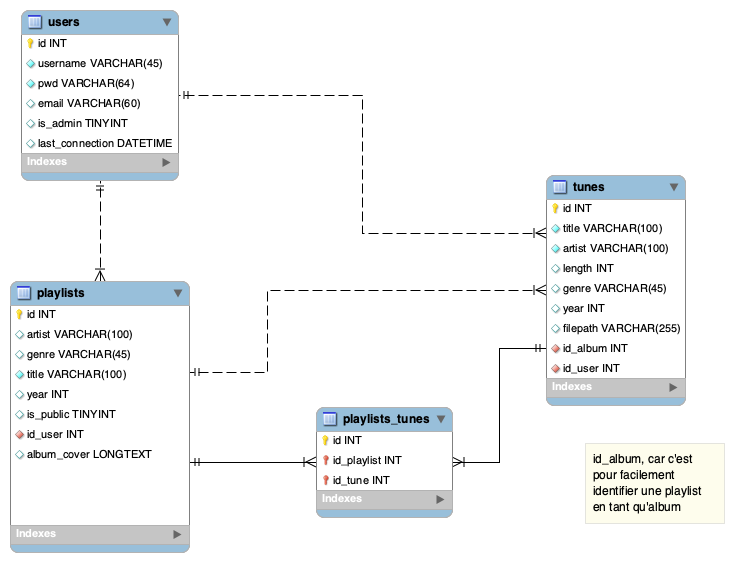

# Lecteur de musique

## Énoncé
Vous devez développer un lecteur de musique en WPF et MVVM. Le lecteur doit simuler un lecteur de musique classique avec les fonctionnalités qui sont décrites ci-dessous.

# Sommaire <!-- omit in toc -->
- [Lecteur de musique](#lecteur-de-musique)
  - [Énoncé](#énoncé)
- [Fonctionnalités](#fonctionnalités)
  - [Listes de lecture](#listes-de-lecture)
  - [Morceaux](#morceaux)
  - [Album](#album)
  - [Utilisateur](#utilisateur)
  - [Connexion](#connexion)
  - [Autres](#autres)
  - [Schéma de la base de données](#schéma-de-la-base-de-données)
- [Informations supplémentaires](#informations-supplémentaires)
- [Références intéressantes](#références-intéressantes)

# Fonctionnalités
Voici la liste des fonctionnalités que devra avoir le lecteur de musique.

## Listes de lecture
* Créer une nouvelle playlist
* Afficher les playlists existantes
* Afficher le contenu d'une playlist
* Mettre à jour le contenu d'une playlist
* Ajouter/Supprimer un morceau d'une playlist
* Jouer une playlist
* Jouer en lecture aléatoire une playlist
* Jouer le prochain morceau ou le précédent d'une playlist
* Afficher la durée totale d'une playlist ainsi que le nombre de morceaux

## Morceaux
* Afficher la liste des morceaux disponibles
* Ajouter un nouveau morceau à la liste des morceaux disponibles
* Supprimer un morceau de la liste des morceaux disponibles
  * Seul l'utilisateur qui a ajouté le morceau peut le supprimer
* Mettre à jour les informations d'un morceau
  * Chaque morceau doit avoir le titre, l'artiste, la durée (entier), le genre, l'année de sortie, le chemin vers le fichier audio, l'album et la pochette de l'album
    * Voir la section Album
* Rechercher un morceau par titre, artiste, genre, année de sortie, album
* Apprécier un morceau
  * Cette fonctionnalité génère une playlist "Liked songs" qui contient tous les morceaux appréciés par l'utilisateur
* Jouer/Mettre en pause un morceau

## Album
* Afficher la liste des morceaux
* Créer un nouvel album à partir d'un morceau
* Afficher la pochette, l'artiste, le titre, la durée, le genre et l'année de sortie
* Supprimer un album
    * Seul l'utilisateur qui a ajouté l'album peut le supprimer.
    * La suppression d'un album ne supprime pas automatiquement les morceaux qui le composent. L'application doit demander à l'utilisateur s'il veut supprimer les morceaux ou non. Si ce n'est pas le cas, les morceaux seront déplacés dans l'album "Unknown album".
* Note :
  * Un album est une spécialisation d'une playlist
  * Il devra y avoir un album "Unknown Album" qui contient tous les morceaux qui n'ont pas d'album

## Utilisateur
* Il y aura un utilisateur administrateur qui pourra effectuer les CRUD sur les utilisateurs.
* L'administrateur devra pouvoir :
  * Créer un nouvel utilisateur
  * Mettre à jour les informations d'un utilisateur
  * Supprimer un utilisateur
  * Afficher la liste des utilisateurs
  * Rechercher un utilisateur par nom d'utilisateur, courriel
* La suppression d'un utilisateur ne supprime pas les playlists, albums et morceaux qu'il a ajouté. Toutefois, la propriété de ces éléments est transférée à l'utilisateur administrateur.
* Voici les champs que chaque utilisateur devra avoit :
  * Nom d'utilisateur
  * Mot de passe (encrypté)
  * Courriel
  * Est administrateur

## Connexion
* S'inscrire
* Se connecter
* Se déconnecter
* Se rappeler du mot de passe

## Autres
* Pour jouer un morceau, l'application simulera une lecture de fichier audio. Il n'y aura pas de fichier audio réel. La progression de la lecture sera simulée par un timer avec une barre de progression.
  * Toutefois, si vous voulez utiliser des fichiers audio réels, vous pouvez le faire.

## Schéma de la base de données
Voici le schéma de la base de données que vous devez utiliser pour ce projet.

# Informations supplémentaires
* Vous devez utiliser le patron MVVM pour ce projet.
* Chacun doit développer sa partie du projet. Vous devez donc utiliser Git pour gérer le projet.
* Voici les différentes parties du projet :
  * Fenêtre de connexion
  * Contrôle utilisateur pour les listes de lecture de l'utilisateur
  * Contrôle utilisateur pour les morceaux de la liste de lecture
  * Contrôle utilisateur pour l'album de musique
  * Contrôle utilisateur pour afficher l'ensemble des morceaux disponibles

# Références intéressantes
* [WPF - Navigation entre les vues](https://www.youtube.com/watch?v=1_cUgpWqS0Y)
* [Navigation - WPF MVVM TUTORIAL - Mediator Design Pattern](https://www.youtube.com/watch?v=bBoYHl3pLEo)
* [Navigating Between Views - Full App](https://www.youtube.com/watch?v=W4n0U3BM-0s)
  * Plusieurs vidéos qui montre comment faire une application complète avec MVVM et navigation entre les vues